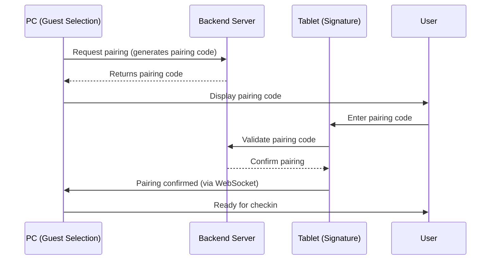
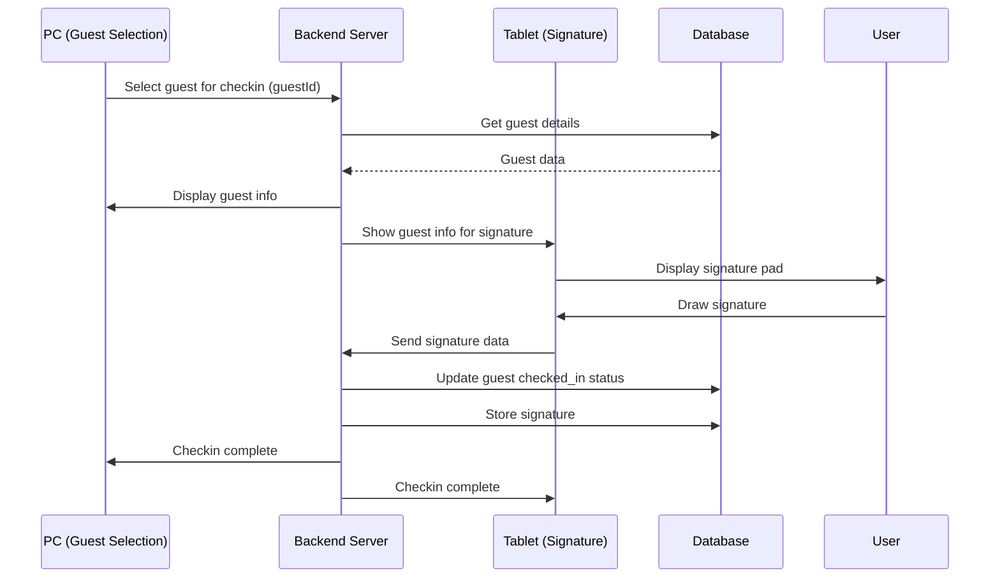

# Checkin-Tool Project Structure & Technology Stack

## Overview

This document describes the architecture, directory structure, and technology stack for the Checkin-Tool application - a guest management system with Vue.js frontend, PHP backend, and MySQL database.

---

## Project Architecture

```
┌─────────────────────────────────────────────────────────────────┐
│                        Checkin-Tool Application                     │
├─────────────────────────────────────────────────────────────────┤
│                                                                     │
│  ┌─────────────────┐    ┌─────────────────┐    ┌─────────────┐  │
│  │   Vue.js         │    │    PHP          │    │   MySQL     │  │
│  │   Frontend       │◄──►│    Backend      │◄──►│   Database  │  │
│  │   (Port: 8080)   │    │   (Port: 8000)  │    │   (Port: 3306)│  │
│  └─────────────────┘    └─────────────────┘    └─────────────┘  │
│                                                                     │
│  ┌─────────────────────────────────────────────────────────────┐│
│  │                    Device Pair Communication                    ││
│  │  ┌─────────────┐          ┌─────────────┐                     ││
│  │  │    PC       │          │   Tablet    │                     ││
│  │  │ (Guest      │◄────────►│ (Signature  │                     ││
│  │  │  Selection) │  WebSocket  │  Collection)│                     ││
│  │  └─────────────┘          └─────────────┘                     ││
│  └─────────────────────────────────────────────────────────────┘│
│                                                                     │
└─────────────────────────────────────────────────────────────────┘
```

---

## Directory Structure

```
checkin-tool/
├── frontend/                          # Vue.js Application
│   ├── public/                        # Static files
│   │   ├── index.html                 # Main HTML template
│   │   ├── favicon.ico                # Favicon
│   │   └── assets/                    # Static assets
│   │
│   ├── src/                           # Source files
│   │   ├── assets/                    # Compiled assets (CSS, images)
│   │   │   ├── styles/                # Global styles
│   │   │   │   ├── main.scss          # Main SCSS file
│   │   │   │   ├── variables.scss     # SCSS variables
│   │   │   │   └── components/        # Component-specific styles
│   │   │   └── images/                # Image assets
│   │   │
│   │   ├── components/                # Vue components
│   │   │   ├── common/                # Reusable components
│   │   │   │   ├── Modal.vue          # Modal component
│   │   │   │   ├── LoadingSpinner.vue # Loading indicator
│   │   │   │   ├── Alert.vue          # Alert/notification component
│   │   │   │   └── Pagination.vue     # Pagination component
│   │   │   │
│   │   │   ├── layout/                # Layout components
│   │   │   │   ├── Header.vue         # Application header
│   │   │   │   ├── Sidebar.vue        # Sidebar navigation
│   │   │   │   └── Footer.vue         # Application footer
│   │   │   │
│   │   │   ├── guests/                # Guest-related components
│   │   │   │   ├── GuestList.vue      # Guest list with filtering
│   │   │   │   ├── GuestCard.vue      # Individual guest card
│   │   │   │   ├── GuestDetails.vue   # Guest details panel
│   │   │   │   ├── GuestForm.vue      # Add/edit guest form
│   │   │   │   └── GuestFilter.vue    # Filter builder component
│   │   │   │
│   │   │   ├── checkout/              # Checkin components
│   │   │   │   ├── CheckinModal.vue   # Checkin confirmation modal
│   │   │   │   ├── SignaturePad.vue   # Signature collection component
│   │   │   │   └── CheckinStatus.vue  # Checkin status indicator
│   │   │   │
│   │   │   └── statistics/            # Statistics components
│   │   │       ├── StatsModal.vue     # Statistics modal
│   │   │       ├── StatsChart.vue     # Chart components
│   │   │       └── StatsSummary.vue   # Summary statistics
│   │   │
│   │   ├── composables/               # Vue 3 composables
│   │   │   ├── useGuests.js           # Guest data management
│   │   │   ├── useFilter.js           # Filter logic
│   │   │   ├── useCheckin.js          # Checkin functionality
│   │   │   ├── useWebSocket.js        # WebSocket communication
│   │   │   └── useApi.js              # API communication
│   │   │
│   │   ├── stores/                    # Pinia stores (state management)
│   │   │   ├── guestStore.js          # Guest state
│   │   │   ├── filterStore.js         # Filter state
│   │   │   ├── checkinStore.js        # Checkin state
│   │   │   └── uiStore.js             # UI state (modals, loading, etc.)
│   │   │
│   │   ├── router/                    # Vue Router
│   │   │   └── index.js               # Route definitions
│   │   │
│   │   ├── views/                     # Page views
│   │   │   ├── HomeView.vue           # Main dashboard
│   │   │   ├── GuestsView.vue         # Guest management page
│   │   │   ├── CheckinView.vue        # Checkin interface
│   │   │   └── StatsView.vue          # Statistics page
│   │   │
│   │   ├── App.vue                    # Root component
│   │   └── main.js                    # Application entry point
│   │
│   ├── .env                           # Environment variables
│   ├── .env.example                   # Example environment variables
│   ├── package.json                   # NPM dependencies and scripts
│   ├── vite.config.js                 # Vite configuration
│   └── index.html                     # Main HTML (alternative location)
│
├── backend/                           # PHP Backend
│   ├── public/                        # Publicly accessible files
│   │   └── index.php                  # Front controller
│   │
│   ├── src/                           # Source files
│   │   ├── Controllers/               # Controller classes
│   │   │   ├── GuestController.php    # Guest management
│   │   │   ├── CheckinController.php  # Checkin operations
│   │   │   ├── StatsController.php    # Statistics operations
│   │   │   └── ApiController.php      # General API endpoints
│   │   │
│   │   ├── Models/                    # Data models
│   │   │   ├── Guest.php              # Guest model
│   │   │   ├── Connection.php          # Guest connection model
│   │   │   └── BaseModel.php          # Base model class
│   │   │
│   │   ├── Services/                  # Business logic services
│   │   │   ├── GuestService.php       # Guest business logic
│   │   │   ├── CheckinService.php     # Checkin business logic
│   │   │   ├── FilterService.php      # Filter processing
│   │   │   └── StatsService.php       # Statistics calculation
│   │   │
│   │   ├── Repositories/              # Data access layer
│   │   │   ├── GuestRepository.php    # Guest database operations
│   │   │   └── BaseRepository.php     # Base repository
│   │   │
│   │   ├── Middleware/                # HTTP middleware
│   │   │   ├── AuthMiddleware.php     # Authentication (if needed)
│   │   │   ├── CorsMiddleware.php     # CORS handling
│   │   │   └── JsonMiddleware.php     # JSON response handling
│   │   │
│   │   ├── Routes/                    # Route definitions
│   │   │   ├── api.php                # API routes
│   │   │   └── web.php                # Web routes
│   │   │
│   │   ├── Config/                    # Configuration files
│   │   │   ├── database.php           # Database configuration
│   │   │   ├── app.php                # Application configuration
│   │   │   └── websocket.php          # WebSocket configuration
│   │   │
│   │   ├── Utilities/                 # Utility classes
│   │   │   ├── ResponseHelper.php     # Response formatting
│   │   │   ├── ValidationHelper.php   # Data validation
│   │   │   └── Logger.php             # Logging utility
│   │   │
│   │   ├── WebSocket/                 # WebSocket server
│   │   │   ├── Server.php             # WebSocket server
│   │   │   ├── Handlers/              # WebSocket message handlers
│   │   │   │   └── CheckinHandler.php # Checkin-specific handler
│   │   │   └── Messages/              # Message classes
│   │   │       └── CheckinMessage.php # Checkin message structure
│   │   │
│   │   └── bootstrap.php              # Application bootstrap
│   │
│   ├── vendor/                        # Composer dependencies
│   ├── .env                           # Environment variables
│   ├── .env.example                   # Example environment variables
│   ├── composer.json                  # Composer dependencies
│   └── composer.lock                  # Composer lock file
│
├── database/                         # Database files
│   ├── migrations/                    # Database migrations
│   │   ├── 2024_01_01_create_guests_table.php
│   │   └── 2024_01_02_create_connections_table.php
│   │
│   ├── seeds/                         # Database seeders
│   │   └── GuestsSeeder.php           # Sample guest data
│   │
│   └── schema.sql                     # Complete database schema
│
├── docker/                           # Docker configuration
│   ├── docker-compose.yml             # Docker Compose configuration
│   ├── php/Dockerfile                 # PHP Dockerfile
│   ├── nginx/Dockerfile               # Nginx Dockerfile
│   ├── nginx/conf.d/app.conf          # Nginx configuration
│   └── mysql/Dockerfile               # MySQL Dockerfile
│
├── tests/                            # Test files
│   ├── frontend/                      # Frontend tests
│   │   ├── unit/                      # Unit tests
│   │   └── e2e/                       # End-to-end tests
│   │
│   └── backend/                       # Backend tests
│       ├── unit/                      # Unit tests
│       └── integration/               # Integration tests
│
├── docs/                             # Documentation
│   ├── API.md                         # API documentation
│   ├── DATABASE.md                    # Database documentation
│   ├── DEPLOYMENT.md                 # Deployment guide
│   └── DEVELOPMENT.md                # Development setup
│
├── .gitignore                        # Git ignore rules
├── README.md                         # Project README
├── PROJECT_STRUCTURE.md              # This file
└── Makefile                          # Common commands
```

---

## Technology Stack

### Frontend

| Technology | Version | Purpose | Documentation |
|------------|---------|---------|---------------|
| [Vue.js](https://vuejs.org/) | 3.x | Progressive JavaScript Framework | [Docs](https://vuejs.org/guide/) |
| [Vite](https://vitejs.dev/) | 5.x | Build tool and dev server | [Docs](https://vitejs.dev/guide/) |
| [Pinia](https://pinia.vuejs.org/) | 2.x | State management | [Docs](https://pinia.vuejs.org/) |
| [Vue Router](https://router.vuejs.org/) | 4.x | Client-side routing | [Docs](https://router.vuejs.org/) |
| [Axios](https://axios-http.com/) | 1.x | HTTP client | [Docs](https://axios-http.com/docs/intro) |
| [Sass/SCSS](https://sass-lang.com/) | Latest | CSS preprocessor | [Docs](https://sass-lang.com/documentation/) |
| [Bootstrap Vue](https://bootstrap-vue.org/) | 3.x | UI component library | [Docs](https://bootstrap-vue.org/docs) |
| [Vue Chart.js](https://vue-chartjs.org/) | 5.x | Chart components | [Docs](https://vue-chartjs.org/guide/) |
| [Socket.IO Client](https://socket.io/docs/v4/client-api/) | 4.x | WebSocket client | [Docs](https://socket.io/docs/v4/client-api/) |

### Backend

| Technology | Version | Purpose | Documentation |
|------------|---------|---------|---------------|
| [PHP](https://www.php.net/) | 8.2+ | Server-side scripting | [Docs](https://www.php.net/docs.php) |
| [Slim Framework](https://www.slimframework.com/) | 4.x | Micro framework | [Docs](https://www.slimframework.com/docs/v4/) |
| [Eloquent ORM](https://laravel.com/docs/10.x/eloquent) | 10.x | Database ORM | [Docs](https://laravel.com/docs/10.x/eloquent) |
| [PHP-DI](https://php-di.org/) | 7.x | Dependency Injection | [Docs](https://php-di.org/doc/) |
| [Monolog](https://github.com/Seldaek/monolog) | 3.x | Logging | [Docs](https://github.com/Seldaek/monolog) |
| [vlucas/phpdotenv](https://github.com/vlucas/phpdotenv) | 5.x | Environment variables | [Docs](https://github.com/vlucas/phpdotenv) |
| [Ratchet](http://socketo.me/) | 0.4.x | WebSocket server | [Docs](http://socketo.me/docs) |

### Database

| Technology | Version | Purpose | Documentation |
|------------|---------|---------|---------------|
| [MySQL](https://www.mysql.com/) | 8.0+ | Relational database | [Docs](https://dev.mysql.com/doc/) |
| [phpMyAdmin](https://www.phpmyadmin.net/) | 5.x | Database management UI | [Docs](https://www.phpmyadmin.net/docs/) |

### Development Tools

| Tool | Version | Purpose | Documentation |
|------|---------|---------|---------------|
| [Node.js](https://nodejs.org/) | 20.x | JavaScript runtime | [Docs](https://nodejs.org/en/docs) |
| [NPM](https://www.npmjs.com/) | 10.x | Package manager | [Docs](https://docs.npmjs.com/) |
| [Composer](https://getcomposer.org/) | 2.x | PHP dependency manager | [Docs](https://getcomposer.org/doc/) |
| [Docker](https://www.docker.com/) | 24.x | Containerization | [Docs](https://docs.docker.com/) |
| [Docker Compose](https://docs.docker.com/compose/) | 2.x | Multi-container orchestration | [Docs](https://docs.docker.com/compose/) |
| [Git](https://git-scm.com/) | 2.x | Version control | [Docs](https://git-scm.com/doc) |
| [ESLint](https://eslint.org/) | 8.x | JavaScript linting | [Docs](https://eslint.org/docs/latest/) |
| [Prettier](https://prettier.io/) | 3.x | Code formatting | [Docs](https://prettier.io/docs/en/index.html) |
| [PHPStan](https://phpstan.org/) | 1.x | PHP static analysis | [Docs](https://phpstan.org/user-guide/getting-started) |
| [PHPUnit](https://phpunit.de/) | 10.x | PHP testing | [Docs](https://phpunit.de/documentation.html) |
| [Vitest](https://vitest.dev/) | 1.x | JavaScript testing | [Docs](https://vitest.dev/) |

### Production Tools

| Tool | Purpose | Documentation |
|------|---------|---------------|
| [Nginx](https://www.nginx.com/) | Web server / Reverse proxy | [Docs](https://nginx.org/en/docs/) |
| [PM2](https://pm2.keymetrics.io/) | Process manager (Node.js) | [Docs](https://pm2.keymetrics.io/docs/usage/quick-start/) |
| [Supervisor](http://supervisord.org/) | Process manager (PHP) | [Docs](http://supervisord.org/configuration.html) |

---

## Database Schema

### Tables

#### 1. `guests`

```sql
CREATE TABLE `guests` (
  `id` INT AUTO_INCREMENT PRIMARY KEY,
  `register_id` VARCHAR(50) UNIQUE NOT NULL,
  `full_name` VARCHAR(255) NOT NULL,
  `age` INT,
  `category` ENUM('standard', 'vip', 'family', 'group', 'other') DEFAULT 'standard',
  `arrival_day` DATE NOT NULL,
  `checked_in` BOOLEAN DEFAULT FALSE,
  `checkin_date` DATETIME NULL,
  `note` TEXT,
  `signature_id` VARCHAR(255) NULL,
  `created_at` TIMESTAMP DEFAULT CURRENT_TIMESTAMP,
  `updated_at` TIMESTAMP DEFAULT CURRENT_TIMESTAMP ON UPDATE CURRENT_TIMESTAMP,
  
  INDEX idx_category (category),
  INDEX idx_arrival_day (arrival_day),
  INDEX idx_checked_in (checked_in),
  INDEX idx_register_id (register_id),
  FULLTEXT INDEX idx_full_name (full_name)
);
```

#### 2. `connections`

```sql
CREATE TABLE `connections` (
  `id` INT AUTO_INCREMENT PRIMARY KEY,
  `guest_id` INT NOT NULL,
  `connected_guest_id` INT NOT NULL,
  `connection_type` ENUM('family', 'friend', 'colleague', 'group', 'other') DEFAULT 'group',
  `created_at` TIMESTAMP DEFAULT CURRENT_TIMESTAMP,
  
  FOREIGN KEY (guest_id) REFERENCES guests(id) ON DELETE CASCADE,
  FOREIGN KEY (connected_guest_id) REFERENCES guests(id) ON DELETE CASCADE,
  
  UNIQUE KEY unique_connection (guest_id, connected_guest_id),
  INDEX idx_guest_id (guest_id),
  INDEX idx_connected_guest_id (connected_guest_id)
);
```

#### 3. `signatures` (Optional - for storing signature data)

```sql
CREATE TABLE `signatures` (
  `id` VARCHAR(255) PRIMARY KEY,
  `guest_id` INT NOT NULL,
  `signature_data` LONGTEXT NOT NULL,  -- Base64 encoded image
  `created_at` TIMESTAMP DEFAULT CURRENT_TIMESTAMP,
  
  FOREIGN KEY (guest_id) REFERENCES guests(id) ON DELETE CASCADE
);
```

---

## API Endpoints

### Base URL
```
http://localhost:8000/api/v1
```

### Guest Endpoints

| Method | Endpoint | Description | Parameters |
|--------|----------|-------------|------------|
| GET | `/guests` | Get all guests with optional filtering | `category`, `checked_in`, `arrival_day`, `search`, `page`, `limit` |
| GET | `/guests/{id}` | Get a single guest by ID | - |
| GET | `/guests/register/{registerId}` | Get a guest by register ID | - |
| POST | `/guests` | Create a new guest | Guest data in request body |
| PUT | `/guests/{id}` | Update a guest | Guest data in request body |
| DELETE | `/guests/{id}` | Delete a guest | - |

### Checkin Endpoints

| Method | Endpoint | Description | Parameters |
|--------|----------|-------------|------------|
| POST | `/checkin/start/{guestId}` | Start checkin process for a guest | - |
| POST | `/checkin/complete/{guestId}` | Complete checkin with signature | `signature_data` (base64) |
| POST | `/checkin/cancel/{guestId}` | Cancel checkin process | - |
| GET | `/checkin/status/{guestId}` | Get checkin status | - |

### Connection Endpoints

| Method | Endpoint | Description | Parameters |
|--------|----------|-------------|------------|
| GET | `/guests/{id}/connections` | Get connections for a guest | - |
| POST | `/guests/{id}/connections` | Add a connection | `connected_guest_id`, `connection_type` |
| DELETE | `/guests/{id}/connections/{connectionId}` | Remove a connection | - |

### Statistics Endpoints

| Method | Endpoint | Description | Parameters |
|--------|----------|-------------|------------|
| GET | `/stats/summary` | Get summary statistics | - |
| GET | `/stats/by-category` | Get statistics by category | - |
| GET | `/stats/by-day` | Get statistics by arrival day | - |
| GET | `/stats/remaining` | Get count of guests not checked in | - |

### WebSocket Endpoints

| Endpoint | Description | Events |
|----------|-------------|--------|
| `ws://localhost:8080` | WebSocket server for device pairing | `pair:request`, `pair:response`, `checkin:start`, `checkin:complete`, `checkin:cancel` |

---

## Communication Flow

### Device Pairing for Checkin



### Checkin Process



---

## Environment Variables

### Frontend (.env)

```env
VITE_API_BASE_URL=http://localhost:8000/api/v1
VITE_WS_BASE_URL=ws://localhost:8080
VITE_APP_TITLE=Checkin-Tool
VITE_APP_VERSION=1.0.0
```

### Backend (.env)

```env
APP_ENV=development
APP_DEBUG=true
APP_TIMEZONE=UTC

DB_HOST=mysql
DB_PORT=3306
DB_DATABASE=checkin_tool
DB_USERNAME=checkin_user
DB_PASSWORD=checkin_password

WS_HOST=0.0.0.0
WS_PORT=8080

JWT_SECRET=your_jwt_secret_key
```

---

## Development Setup

### Prerequisites

- Node.js 20.x
- PHP 8.2+
- MySQL 8.0+
- Composer 2.x
- Docker & Docker Compose (optional)

### Quick Start with Docker

```bash
# Clone the repository
git clone https://github.com/RobinKubatzki/mistral-test.git
cd mistral-test

# Start all services
docker-compose up -d

# Access the application
# Frontend: http://localhost:3000
# Backend API: http://localhost:8000
# phpMyAdmin: http://localhost:8081
```

### Manual Setup

#### Frontend

```bash
cd frontend
npm install
npm run dev
```

#### Backend

```bash
cd backend
composer install
php -S localhost:8000 -t public
```

#### Database

```bash
# Create database
mysql -u root -p -e "CREATE DATABASE checkin_tool;"

# Import schema
mysql -u root -p checkin_tool < database/schema.sql
```

---

## Build & Deployment

### Frontend Build

```bash
cd frontend
npm run build
```

Outputs to `frontend/dist/` which should be served by the web server.

### Backend Setup

```bash
cd backend
composer install --no-dev --optimize-autoloader
```

### Production Environment

```env
# Frontend
NODE_ENV=production

# Backend
APP_ENV=production
APP_DEBUG=false

# Database
DB_HOST=production_db_host
DB_DATABASE=checkin_tool_prod
DB_USERNAME=checkin_user_prod
DB_PASSWORD=secure_password
```

---

## Project Conventions

### Code Style

- **Frontend**: ESLint with Prettier
- **Backend**: PSR-12 coding standard
- **Commit Messages**: Conventional Commits (feat, fix, docs, etc.)

### File Naming

- **Components**: PascalCase (e.g., `GuestList.vue`)
- **Composables**: camelCase with `use` prefix (e.g., `useGuests.js`)
- **Stores**: camelCase with `Store` suffix (e.g., `guestStore.js`)
- **Controllers**: PascalCase with `Controller` suffix (e.g., `GuestController.php`)
- **Models**: PascalCase (e.g., `Guest.php`)
- **Services**: PascalCase with `Service` suffix (e.g., `GuestService.php`)

### Branch Naming

- `main` - Production ready code
- `develop` - Development branch
- `feature/*` - New features
- `fix/*` - Bug fixes
- `docs/*` - Documentation updates
- `refactor/*` - Code refactoring

---

## Security Considerations

1. **Input Validation**: All user inputs must be validated on the backend
2. **SQL Injection**: Use prepared statements and ORM methods
3. **XSS Protection**: Sanitize all user-generated content
4. **CSRF Protection**: Implement CSRF tokens for form submissions
5. **Authentication**: Secure API endpoints with JWT or session-based auth
6. **CORS**: Configure proper CORS headers
7. **Rate Limiting**: Implement rate limiting for API endpoints
8. **HTTPS**: Always use HTTPS in production

---

## Performance Considerations

1. **Frontend**: Use lazy loading for components and routes
2. **Backend**: Implement caching for frequently accessed data
3. **Database**: Add proper indexes, use pagination for large datasets
4. **Images**: Optimize and compress images
5. **WebSockets**: Implement connection timeouts and heartbeats

---

## Testing Strategy

### Frontend Tests
- Unit tests for composables and utilities
- Component tests for Vue components
- End-to-end tests for user flows

### Backend Tests
- Unit tests for services and utilities
- Integration tests for controllers and routes
- Database tests for repositories

### Test Coverage Targets
- Frontend: 80%+ coverage
- Backend: 80%+ coverage

---

## Monitoring & Logging

### Frontend
- Error tracking with Sentry or similar
- Console logging for development

### Backend
- Structured logging with Monolog
- Error tracking
- Request/response logging
- Performance metrics

---

## Future Enhancements

1. **Mobile App**: Native mobile application for checkin
2. **QR Codes**: Generate QR codes for faster guest identification
3. **Face Recognition**: Biometric checkin option
4. **Multi-language Support**: Internationalization
5. **Export/Import**: Data export and import functionality
6. **Audit Log**: Track all changes to guest data
7. **Notifications**: Email/SMS notifications for guests
8. **Integration**: Integration with other hotel management systems

---

## License

This project is proprietary. All rights reserved.

---

## Contact

For questions or support, please contact the development team.

---

*Document version: 1.0.0*
*Last updated: $(date)*
